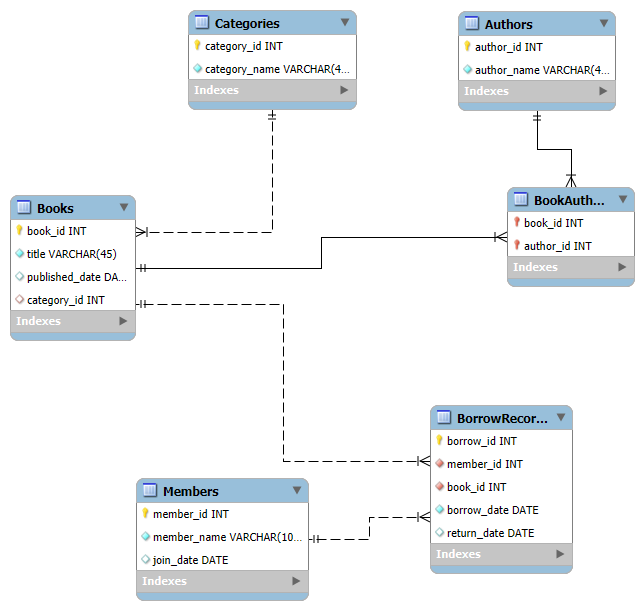

# Library-Database-Schema
Library management system database schema using MySQL Workbench.

## 🏗️ Database Overview

### Tables:
- 📚 `Books`
- 👤 `Authors`
- 🏷 `Categories`
- 📘 `BookAuthors` (many-to-many)
- 🙋‍♂️ `Members`
- 🔄 `BorrowRecords`

## 📂 Files Included

| File | Description |

| `create_library_schema.sql` | SQL script to create tables |
| `library_er_diagram.png`    | ER diagram of the schema |
| `README.md`                 | Project explanation |

## 🔗 ER Diagram

## 🧠 Concepts Used

- DDL (CREATE TABLE)
- Primary and Foreign Keys
- Normalization
- ER Design
- Many-to-Many Relationships

## 👩‍💻 Tools Used

- MySQL Workbench
- GitHub
